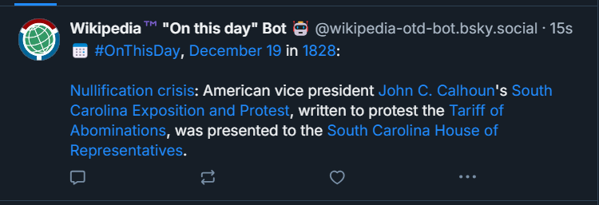

# Wikipedia "On this day" Bluesky Bot 🤖

A Bluesky bot that posts the "On this day" articles from Wikipedia on Bluesky.  
  
The bot will parse the Atom feed \(URL can be defined per [environment variables](#environment-variables)\) and beautify the HTML into nice RichText that will be posted to Bluesky. The RichText will also include custom facets as per the [Bluesky][1] and [atproto][2] documentation in order to incorporate links to the respective Wikipedia pages as present in the original "On this day" article.  
  
Per default, the bot will post one entry of the "On this day" article every other hour, but this can be configured/customized via [environment variables](#environment-variables).

An example post on Bluesky could look something like this:  
  


[1]: https://docs.bsky.app/docs/advanced-guides/post-richtext
[2]: https://atproto.blue/en/latest/atproto/atproto_client.models.app.bsky.richtext.facet.html

## How to run?

Simply run
```
npm install
```
and
```
npm start
```
and you should be good to go!

## Environment variables

This app depends on a couple of environment variables. Some are required in order to run the bot, some are optional and will have default values. Required environment variables are marked with an asterisk \(**\***\)
- `BLUESKY_HANDLE` **\***
  - The handle of your Bluesky Bot
- `BLUESKY_PASSWORD` **\***
  - The password of your Bluesky Bot
- `PDS_URL`
  - The PDS your bot resides on
  - defaults to `https://bsky.social` if not explicitly set
- `RSS_FEED_URL`
  - The feed URL of the Atom/RSS Feed you want to parse
  - defaults to `https://en.wikipedia.org/w/api.php?action=featuredfeed&feed=onthisday&feedformat=atom` if not set
- `WIKIPEDIA_MAIN_URL`
  - The wikipedia URL used for prefixing `/wiki/SomeArticle` URIs
  - defaults to `https://en.wikipedia.org` if not explicitly set
- `DB_PATH`
  - The path where you want to locally save the extracted HTML from the Atom feed as well as the content posted to Bluesky
  - defaults to `./database` if not explicitly set
- `ARTICLES_FILENAME`
  - The name of the file where the extracted articles from the Atom feed are stored
  - defaults to `articles.json` if not explicitly set
- `POSTINGS_FILENAME`
  - The name of the file where the content posted to Bluesky will be stored
  - defaults to `postings.json` if not explicitly set
- `LOG_TO_FILE`
  - Whether to log to a physical log file (`true`) or just the console (`false`)
  - defaults to `false` if not explicitly set
- `LOG_DIR`
  - Which directory to write logs to, if `LOG_TO_FILE` is enabled
  - defaults to `./logs` if not explicitly set
- `LOG_NAME`
  - File name of the log file to write
  - defaults to `wikipedia-otd-bsky-bot` if not explicitly set
  - _**NOTE:** do not include the file extension, as this will be set automatically to `.log`_
- `LOG_LEVEL`
  - which logs to write to the console
  - Supported values: `TRACE`, `DEBUG`, `INFO`, `WARNING`, `ERROR`, `CRITICAL`
  - defaults to `INFO` if not explicitly set
- `DEBUG_MODE`
  - if enabled, the app will not try logging in to Bluesky and just output the potential posts to the console
  - defaults to `false` if not explicitly set
- `POST_ONCE_ONLY`
  - if enabled, the bot will only run once and try to post to Bluesky
  - defaults to `false` if not explicitly set
  - _**NOTE:** if `DEBUG_MODE` is set to `true`, the debug mode overrides this setting!_